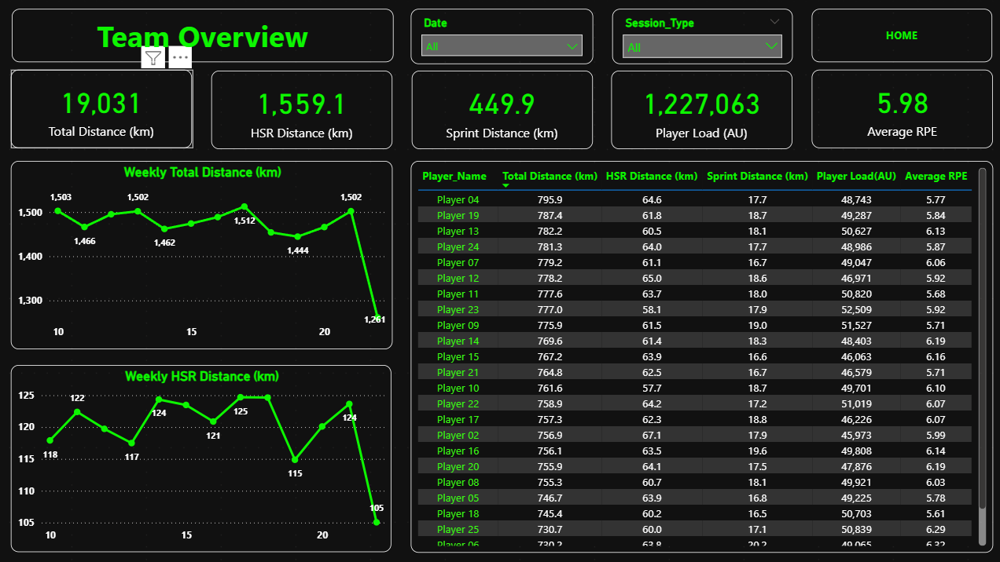
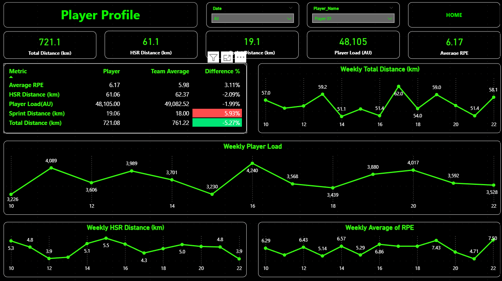
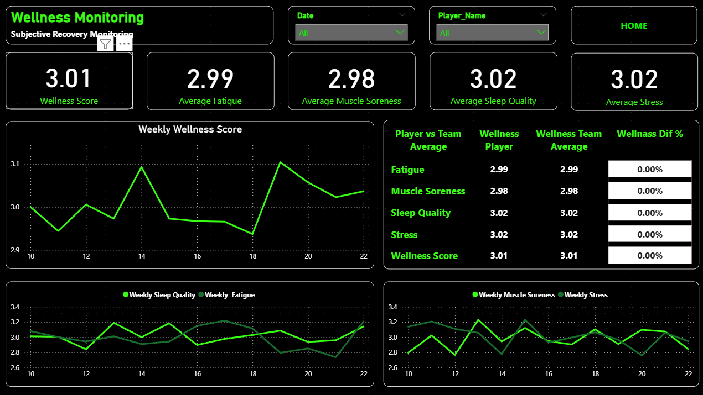
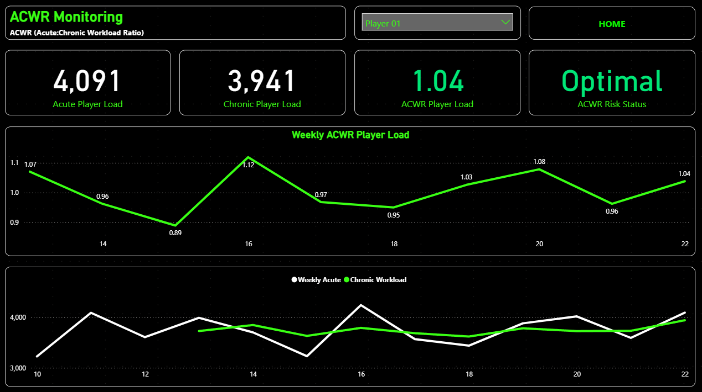

# Football Performance & Workload Monitoring System

A Power BI portfolio project designed to support the monitoring of player workload, physical performance, wellness, and recovery.

The dashboard brings together GPS workload data and subjective wellness information to help performance analysts, fitness coaches, and medical staff identify important changes and support informed discussions about training and recovery.

> Sometimes one day of recovery can protect weeks or months of player availability.

## Project Overview

The system provides both team-level and individual player analysis. It allows users to monitor workload trends, compare a player with the team average, review subjective wellness responses, and analyse the relationship between acute and chronic workload.

This dashboard is intended as a decision-support tool. It does not diagnose injuries or guarantee injury prevention. Its purpose is to provide additional context for qualified coaching, fitness, and medical professionals.

## Dashboard Pages

### 1. Team Overview

Provides an overview of team workload and performance across the selected period.

Key information includes:

* Total Distance
* High-Speed Running Distance
* Sprint Distance
* Player Load
* Average RPE
* Weekly workload trends
* Individual player results
* Date and session-type filters

### 2. Player Profile

Allows users to monitor an individual player and compare their results with the team average.

The page includes:

* Individual workload indicators
* Player versus team-average comparison
* Percentage differences
* Weekly Total Distance
* Weekly HSR Distance
* Weekly Player Load
* Weekly Average RPE

### 3. Wellness Monitoring

Combines subjective recovery information collected from player questionnaires.

Monitored indicators include:

* Fatigue
* Muscle Soreness
* Sleep Quality
* Stress
* Overall Wellness Score
* Player versus team-average comparison
* Weekly wellness trends

### 4. ACWR Monitoring

Shows the relationship between recent workload and longer-term workload using the Acute:Chronic Workload Ratio.

The page contains:

* Acute Player Load
* Chronic Player Load
* ACWR
* Workload status
* Weekly ACWR trend
* Acute and chronic workload comparison

ACWR is presented as one contextual monitoring indicator and should not be used independently to predict injury risk or make medical decisions.

## Why I Built This Project

As a former professional footballer, this topic is personally important to me. During my playing career, I experienced several injuries, including serious ones, which I believe may have been influenced by accumulated fatigue and insufficient recovery.

This experience made me interested in how workload, wellness, and recovery data can support better day-to-day decisions. In my view, for both the player and the club, it is often better to reduce the workload or miss one training session than to lose a player for a month or longer.

I created this project to demonstrate how Power BI can help performance analysts, fitness coaches, and medical staff monitor player workload and wellness, identify concerning changes, and support informed discussions about training and recovery.

## Data Model

The project combines several related data tables:

* Player information
* GPS and physical-performance data
* Wellness questionnaire responses
* Injury records
* Calendar table
* Dedicated metric tables

The dataset contains sample football performance data and does not represent real players.

## Tools and Skills

* Power BI
* Power Query
* DAX
* Data cleaning and transformation
* Data modelling
* KPI development
* Conditional formatting
* Time-based analysis
* Interactive dashboard design
* Football performance analysis

## Files

* Power BI dashboard (`.pbix`)
* Sample dataset
* Dashboard screenshots

## Author

**Bohdan Varchenko**

Former professional footballer and football analyst focused on using data, video, and performance information to support better decision-making in football.
