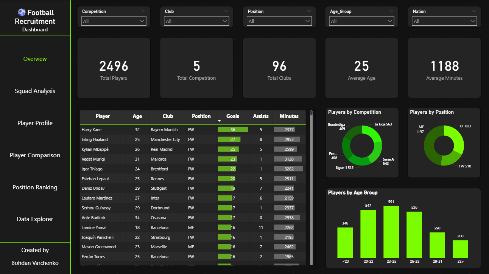
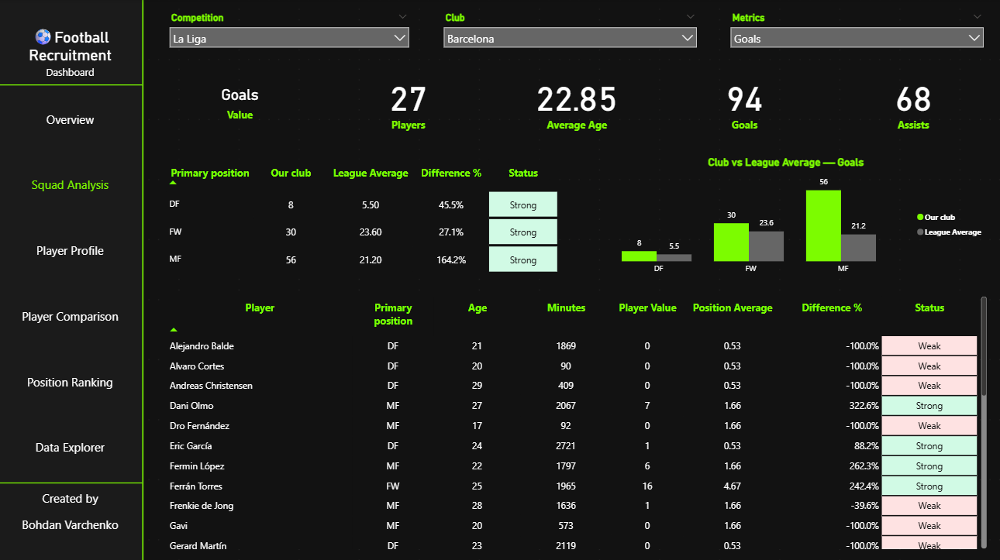
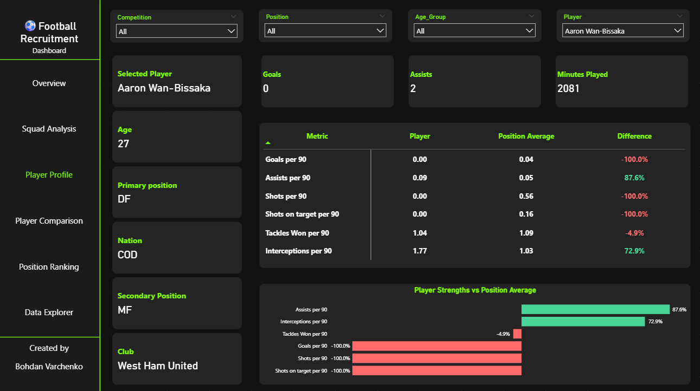
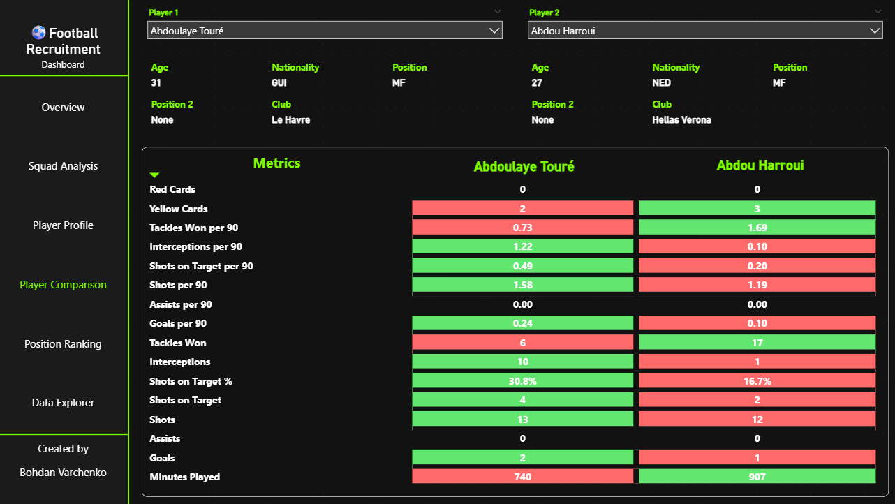
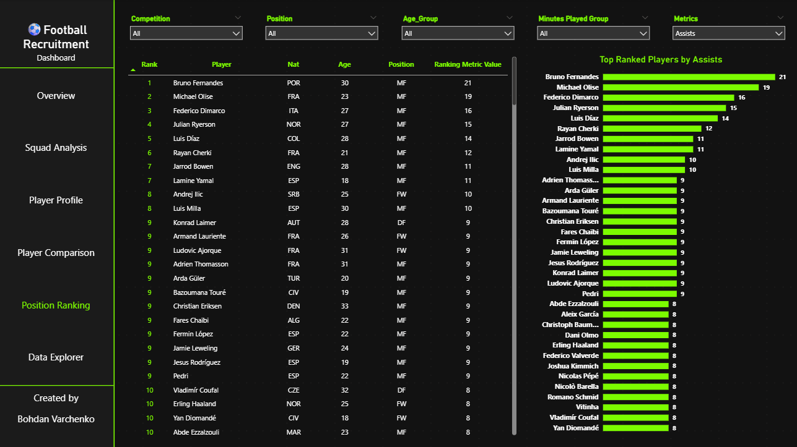
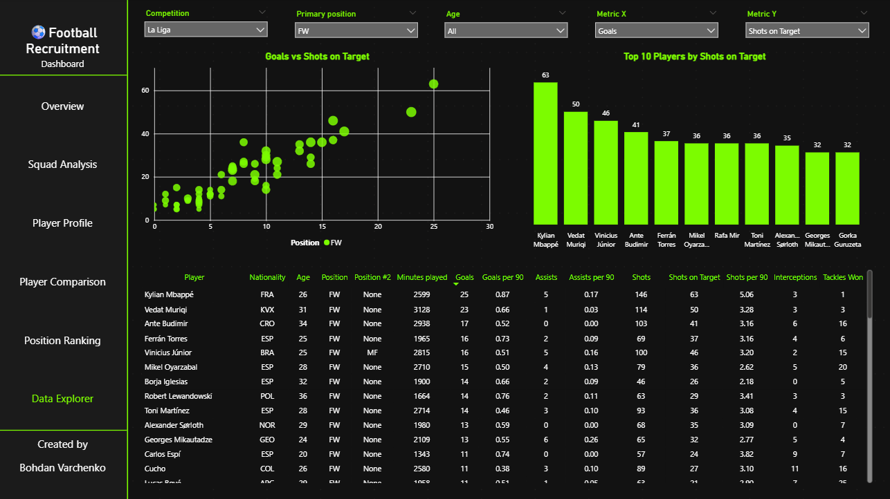

# Football Recruitment Dashboard

An interactive Power BI portfolio project designed to support football recruitment, squad analysis, player evaluation, and performance comparison.

The dashboard analyses more than 2,000 outfield players from 96 clubs across five major European competitions during the 2025/26 season. It allows users to explore player performance, compare players and evaluate results against positional averages.

## Project Objective

The objective of this project is to transform football player data into clear and practical insights that can support recruitment and squad-planning decisions.

The dashboard can help analysts and recruitment staff:

- identify high-performing players using selected metrics;
- evaluate strengths and weaknesses within a squad;
- compare a player with the average for his position;
- compare two players across multiple performance indicators;
- create position-based rankings;
- explore relationships between different metrics.

## Dashboard Pages

### 1. Overview

Provides a high-level summary of the dataset, including the number of players, competitions and clubs, average age, average minutes played, and player distributions by competition, position and age group.



### 2. Squad Analysis

Compares a selected club with the league average by position and metric. It helps identify potentially strong or weak areas of the squad and shows how individual players contribute to those results.



### 3. Player Profile

Displays the selected player's key information and per-90 performance. The player is compared with the average for his primary position to highlight relative strengths and weaknesses.



### 4. Player Comparison

Allows two players to be compared across a dynamic selection of attacking, defensive and disciplinary metrics. Conditional formatting makes differences easy to identify.



### 5. Position Ranking

Ranks players by a selected metric while respecting filters for competition, position, age group and minutes played.



### 6. Data Explorer

Provides flexible analysis through dynamic X and Y metrics, a scatter plot, a Top 10 ranking and a detailed player table.



## Tools and Skills Used

- Power BI
- Power Query
- DAX
- Data cleaning and transformation
- Data modelling
- Dynamic measures and metric selectors
- Ranking with filter context
- Per-90 calculations
- Conditional formatting
- Interactive dashboard design

## Key Metrics

- Minutes played
- Goals and goals per 90
- Assists and assists per 90
- Shots and shots per 90
- Shots on target and shots on target percentage
- Interceptions and interceptions per 90
- Tackles won and tackles won per 90
- Yellow and red cards

## Repository Structure

```text
Football-Recruitment-Dashboard/
|-- Data/
|   `-- players_data-2025_2026.csv
|-- Screenshots/
|   |-- 01_Overview.png
|   |-- 02_Squad_Analysis.png
|   |-- 03_Player_Profile.png
|   |-- 04_Player_Comparison.png
|   |-- 05_Position_Ranking.png
|   `-- 06_Data_Explorer.png
|-- Football_Recruitment_Dashboard.pbix
`-- README.md
```

## Data Source

The project uses publicly available football player statistics obtained from Kaggle. The dataset was cleaned and transformed for portfolio and educational purposes.

The available metrics are limited by the source dataset. With access to more detailed event data, the dashboard could be expanded with advanced recruitment metrics and role-specific analysis.

## Notes

- Goalkeeper data is not included in the current version.
- Positional comparisons are based on three primary groups: defenders, midfielders and forwards.
- The dashboard is a portfolio project and is not affiliated with the clubs, leagues or data providers shown.

## Author

**Bohdan Varchenko**  
Former professional footballer and football analyst developing skills in Power BI, SQL and data analytics.
